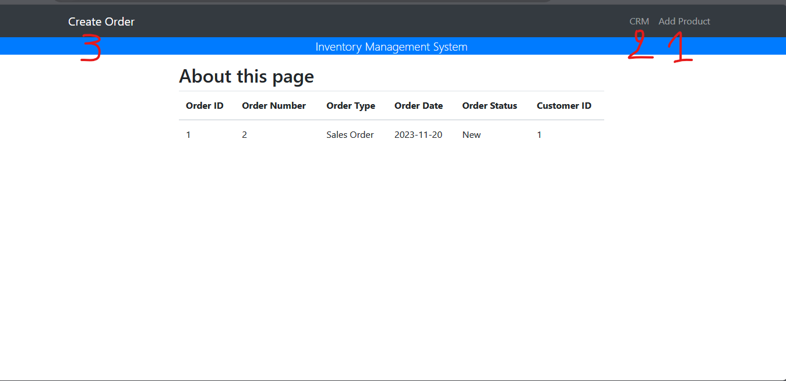
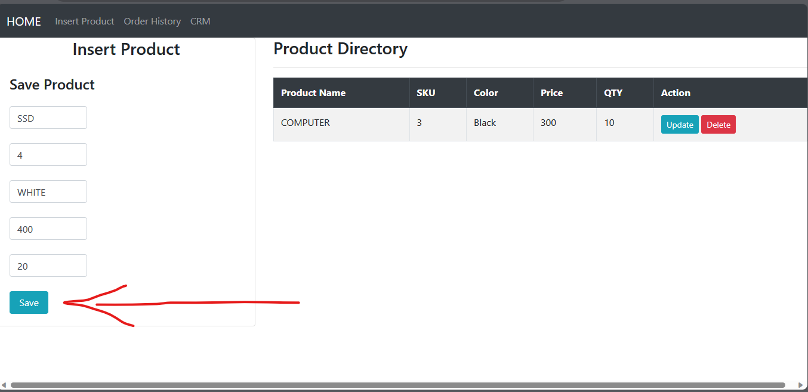
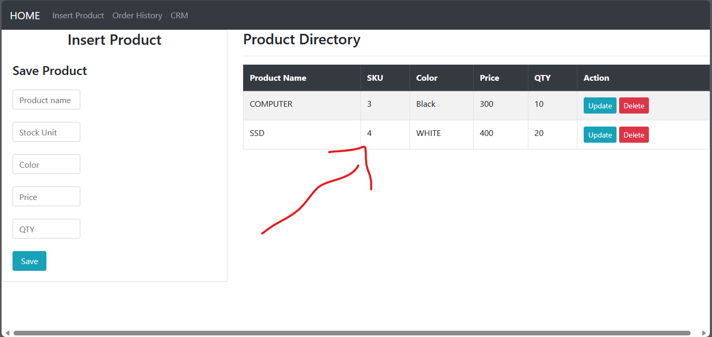
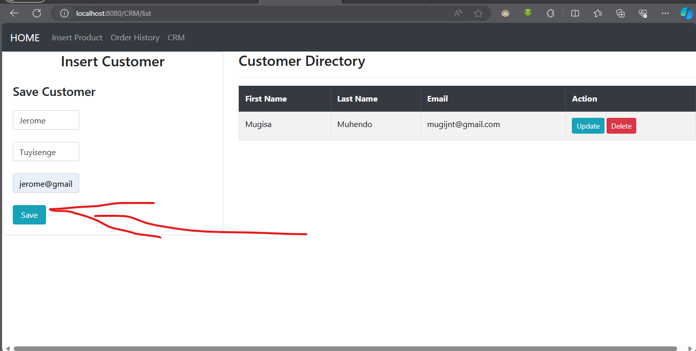
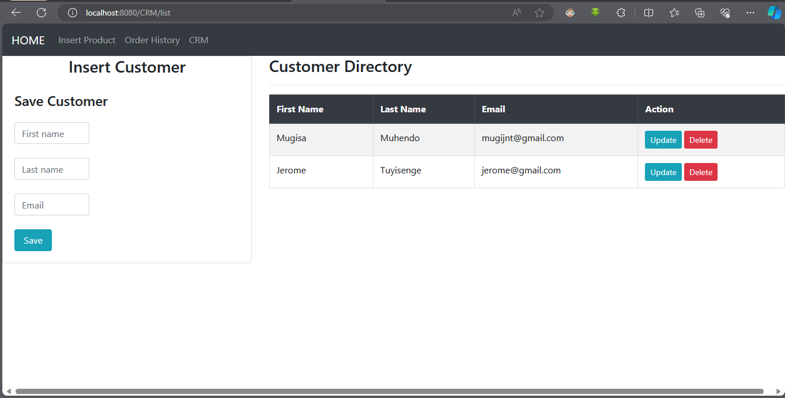
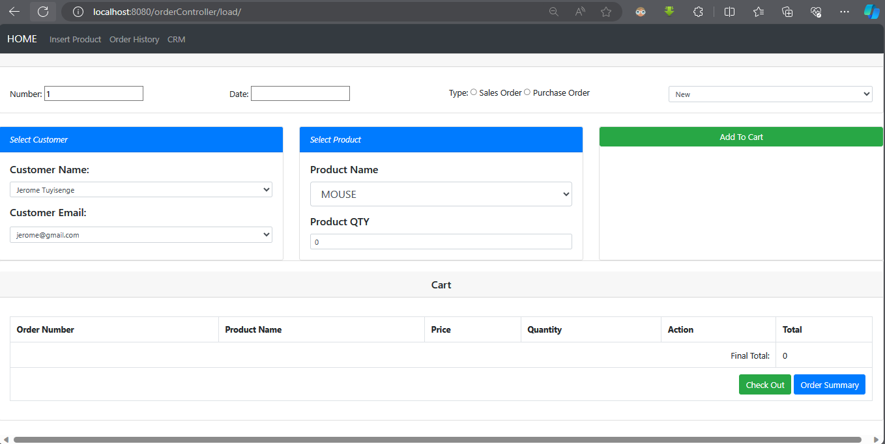
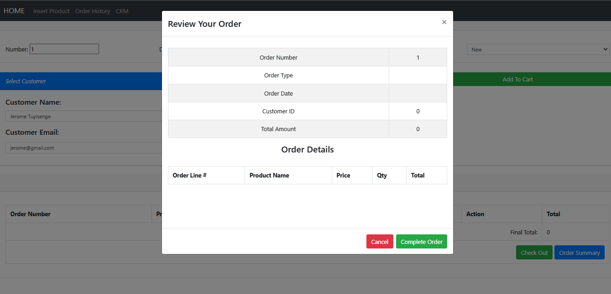

WELCOME TO THE  Spring Boot APP ================>>>>>>> Invetory Management System

 This app can allows a business owner to create and maintain a list of products they sell, a list of their customers and also generate sales and purchase orders for the customer and business owner.

 Below a quick demo in screenshoots

 1.If you click on 1

You can do the crud on product

The added Product

3.If you click on 2

Then you can do the crud on (CRM)(Customer Relotionship Management)

The added customer

3.Create New Order

if you click on 3

You can auto select the customer or project with comes from from db

You can review your order

